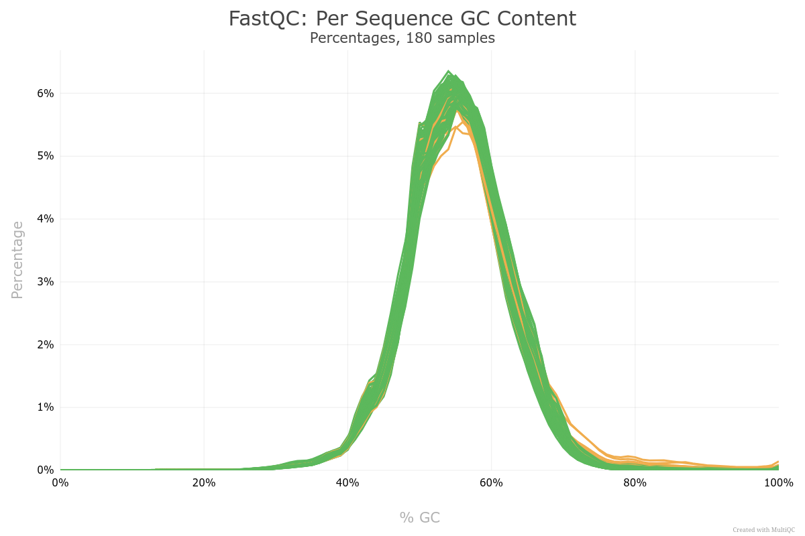

# Project Setup

The transcriptomes of 10 *Klebsiella pneumoniae* clinical strains carrying plasmid pOXA-48, plasmid pVIM-1, or not carrying any of those plasmids (PF, for plasmid-free) were sequenced (three biological replicates for each strain and condition):

* **K25** (ST11): pOXA-48 (PV-J, 59983-C:A SNP affecting *traU*) natural carrier. The plasmid was cured to obtain the PF strain. pVIM-1 was introduced into the PF strain by conjugation.
* **K147** (ST11): pOXA-48 (PV-I) natural carrier. The plasmid was cured to obtain the PF strain. pVIM-1 was introduced into the PF strain by conjugation.
* **K153** (ST11): pOXA-48 (PV-N, 9392-10160 bp deletion affecting IS*1* uptream *bla*<sub>OXA-48</sub>) natural carrier. The plasmid was cured to obtain the PF strain. pVIM-1 was introduced into the PF strain by conjugation.
* **KPN06** (ST11): PF clinical strain for which pOXA-48 (PV-I variant) and pVIM-1 transconjugants were obtained.
* **KPN18** (ST11): PF clinical strain for which pOXA-48 (PV-I variant) and pVIM-1 transconjugants were obtained.
* **K163** (ST307): pOXA-48 (PV-I) natural carrier. The plasmid was cured to obtain the PF strain. pVIM-1 was introduced into the PF strain by conjugation.
* **K198** (ST307): pOXA-48 (PV-I) natural carrier. The plasmid was cured to obtain the PF strain. pVIM-1 was introduced into the PF strain by conjugation.
* **K318** (ST307): pOXA-48 (PV-I) natural carrier. The plasmid was cured to obtain the PF strain. pVIM-1 was introduced into the PF strain by conjugation.
* **KPN11** (ST307): PF clinical strain for which pOXA-48 (PV-I variant) and pVIM-1 transconjugants were obtained.
* **KPN12** (ST307): PF clinical strain for which pOXA-48 (PV-I variant) and pVIM-1 transconjugants were obtained.

pOXA-48 variants (PVs) are described in [DelaFuente *et al.* (2022)](https://doi.org/10.1038/s41559-022-01908-7). PV-I (also called K8) is the most common PV in the R-GNOSIS collection.

Then, the strains and replicates analyzed here (available at BioProject **PRJNA1282931**) are:

|fastq code|strain_genotype_replicate|
|:----|:----|
|5953_001_S38|K25_PF_1|
|5953_002_S39|K25_PF_2|
|5953_003_S40|K25_PF_3|
|5953_004_S41|K25_pOXA-48_1|
|5953_005_S42|K25_pOXA-48_2|
|5953_006_S43|K25_pOXA-48_3|
|5953_007_S44|K25_pVIM-1_1|
|5953_008_S45|K25_pVIM-1_2|
|5953_009_S46|K25_pVIM-1_3|
|5953_010_S47|K147_PF_1|
|5953_011_S48|K147_PF_2|
|5953_012_S49|K147_PF_3|
|5953_013_S50|K147_pOXA-48_1|
|5953_014_S51|K147_pOXA-48_2|
|5953_015_S52|K147_pOXA-48_3|
|5953_016_S53|K147_pVIM-1_1|
|5953_017_S54|K147_pVIM-1_2|
|5953_018_S55|K147_pVIM-1_3|
|5953_019_S56|K153_PF_1|
|5953_020_S57|K153_PF_2|
|5953_021_S58|K153_PF_3|
|5953_022_S59|K153_pOXA-48_1|
|5953_023_S60|K153_pOXA-48_2|
|5953_024_S61|K153_pOXA-48_3|
|5953_025_S62|K153_pVIM-1_1|
|5953_026_S63|K153_pVIM-1_2|
|5953_027_S64|K153_pVIM-1_3|
|5953_028_S65|KPN06_PF_1|
|5953_029_S66|KPN06_PF_2|
|5953_030_S67|KPN06_PF_3|
|5953_031_S68|KPN06_pOXA-48_1|
|5953_032_S69|KPN06_pOXA-48_2|
|5953_033_S70|KPN06_pOXA-48_3|
|5953_034_S71|KPN06_pVIM-1_1|
|5953_035_S72|KPN06_pVIM-1_2|
|5953_036_S73|KPN06_pVIM-1_3|
|5953_037_S74|KPN18_PF_1|
|5953_038_S75|KPN18_PF_2|
|5953_039_S76|KPN18_PF_3|
|5953_040_S77|KPN18_pOXA-48_1|
|5953_041_S78|KPN18_pOXA-48_2|
|5953_042_S79|KPN18_pOXA-48_3|
|5953_043_S80|KPN18_pVIM-1_1|
|5953_044_S6|KPN18_pVIM-1_2|
|5953_045_S7|KPN18_pVIM-1_3|
|5953_046_S8|K163_PF_1|
|5953_047_S9|K163_PF_2|
|5953_048_S10|K163_PF_3|
|5953_049_S11|K163_pOXA-48_1|
|5953_050_S12|K163_pOXA-48_2|
|5953_051_S13|K163_pOXA-48_3|
|5953_052_S14|K163_pVIM-1_1|
|5953_053_S15|K163_pVIM-1_2|
|5953_054_S16|K163_pVIM-1_3|
|5953_055_S17|K198_PF_1|
|5953_056_S18|K198_PF_2|
|5953_057_S19|K198_PF_3|
|5953_058_S20|K198_pOXA-48_1|
|5953_059_S21|K198_pOXA-48_2|
|5953_060_S22|K198_pOXA-48_3|
|5953_061_S23|K198_pVIM-1_1|
|5953_062_S24|K198_pVIM-1_2|
|5953_063_S25|K198_pVIM-1_3|
|5953_064_S26|K318_PF_1|
|5953_065_S27|K318_PF_2|
|5953_066_S28|K318_PF_3|
|5953_067_S29|K318_pOXA-48_1|
|5953_068_S30|K318_pOXA-48_2|
|5953_069_S31|K318_pOXA-48_3|
|5953_070_S32|K318_pVIM-1_1|
|5953_071_S33|K318_pVIM-1_2|
|5953_072_S34|K318_pVIM-1_3|
|5953_073_S35|KPN11_PF_1|
|5953_074_S36|KPN11_PF_2|
|5953_075_S37|KPN11_PF_3|
|5953_076_S38|KPN11_pOXA-48_1|
|5953_077_S39|KPN11_pOXA-48_2|
|5953_078_S40|KPN11_pOXA-48_3|
|5953_079_S41|KPN11_pVIM-1_1|
|5953_080_S42|KPN11_pVIM-1_2|
|5953_081_S43|KPN11_pVIM-1_3|
|5953_082_S44|KPN12_PF_1|
|5953_083_S45|KPN12_PF_2|
|5953_084_S46|KPN12_PF_3|
|5953_085_S47|KPN12_pOXA-48_1|
|5953_086_S48|KPN12_pOXA-48_2|
|5953_087_S49|KPN12_pOXA-48_3|
|5953_088_S50|KPN12_pVIM-1_1|
|5953_089_S51|KPN12_pVIM-1_2|
|5953_090_S52|KPN12_pVIM-1_3|

Create the project directory from which run all commands, and primary directories:

```sh
mkdir RNA-Seq_pOXA-48_pVIM-1
cd RNA-Seq_pOXA-48_pVIM-1
mkdir ./ref_genomes
mkdir -p ./reads_RNAseq/raw_reads
mkdir ./RNAseq_K25
mkdir ./RNAseq_K147
mkdir ./RNAseq_K153
mkdir ./RNAseq_K163
mkdir ./RNAseq_K198
mkdir ./RNAseq_K318
mkdir ./RNAseq_KPN06
mkdir ./RNAseq_KPN11
mkdir ./RNAseq_KPN12
mkdir ./RNAseq_KPN18
```

Then, each strain has its own directory, denoted with the prefix *RNAseq_*, that will contain BAM mapping files and necessary files for conducting differential expression (DE) analysis and calculating TPM values in R.

## Building the pOXA-VIM reference

To prevent reads from plasmid-carrying clones from mapping to both pOXA-48 and pVIM-1 reference plasmids (thus skewing read counts), we manually created a hybrid plasmid to use as a single reference for both plasmids, and therefore for all genotypes of a given strain. This hybrid plasmid, which we called **pOXA-VIM**, includes in the IncL backbone, both the Tn*1999* transposon encoding *bla*<sub>OXA-48</sub> and the integron encoding *bla*<sub>VIM-1</sub>. To construct pOXA-VIM as valid for both plasmids as possible, we blasted (**BLASTn v2.12.0**) the pOXA-48 sequence against pVIM-1 to accurately assess the limits of the structural differences:

```sh
makeblastdb -in ref_genomes/pVIM-1.fasta -dbtype nucl
blastn -db ref_genomes/pVIM-1.fasta -query ref_genomes/pOXA-48_K8.fasta -outfmt 6 > ref_genomes/blastn_pOXA_vs_pVIM.tsv
```

Both plasmids are almost identical in structure, except for the presence/abscence of Tn*1999* and the integron, the absence of *ltrA* in pVIM-1, the length of *relB*, which is 79 bp longer in pVIM-1, and the absence of a CDS encoding a DGQHR domain-containing protein in pVIM-1 (note: the ending sequence of this CDS in pOXA-48 matches the end of the CDS encoding a transposase at the end of the integron in pVIM-1).

We decided to construct pOXA-VIM from the sequence of pOXA-48, to include the *ltrA* gene and the shorter *relB* gene. In the case of the latter, using the shorter gene avoids problems when mapping reads of pOXA-48-carrying strains, as using the longer gene could lead to an underestimation of *relB* expression in these strains. Then, when mapping reads of pVIM-1-carrying strains, reads originating from *relB* matching the 79 bp fragment will just not map anywhere and will not be counted, affecting less the estimation of gene expression.

Regarding the integron, as the second IS*1* and *insB* of pOXA-48 (32412-33109 bp) is shared with the IS*1* and *insB* at the begining of the integron, we inserted the fragment 25667-42155 bp of pVIM-1 (excluding IS*1* and *insB*, and including the ending transposase gene) at position 33164 bp of pOXA-48 (intergenic in both plasmids). Then, up until 33164 bp of pOXA-48, the sequences of the two plasmids are structurally identical (excluding Tn*1999*, *ltrA* and *relB*). In the hybrid plasmid, from 33165 bp onwards, the integron of pVIM-1 is manually inserted, and after the integron transposase gene (the last gene of the integron), the sequence of the hybrid plasmid continues with the CDS encoding the DGQHR domain-containing protein (which end matches the end of the transposase gene).


Next, SNPs between plasmids were assessed by aligning the sequences of pOXA-48 and pVIM-1 to pOXA-VIM using **minimap2 v2.21**: `minimap2 -ax asm5 ref_genomes/pOXA-VIM.fasta ref_genomes/pOXA-48_K8.fasta ref_genomes/pVIM-1.fasta | samtools sort -o ref_genomes/plasmids_aln.bam`.

Alignments were visualized in **IGV v2.19.2**, the correct structure of pOXA-VIM was confirmed and the following SNPs were identified:

* 1 SNP between genes *repA* and *agrB*
* 1 SNP in *umuC*
* 2 SNPs in ORF11
* 1 SNP in *klcA*
* 1 SNP in *ssb*
* 1 SNP between genes pOXA-VIM_00430 and pOXA-VIM_00435
* 1 SNP in *traC* (*pri*)
* 1 SNP in *excA*

## Reference genomes

The genomes of the 10 strains (either PF or pOXA-48-carrying) were sequenced and closed (see Methods of the original publication) to use as reference. The pOXA-48 contig was replaced by the pOXA-VIM reference. Then, the reference genomes were annotated with **Bakta v1.9.3 (database v5.1)** as:

```sh
bakta --db ~/anaconda3/envs/bakta/databases/db --complete --genus Klebsiella --species pneumoniae --strain <strain> --output <output_path>
```

For consistency, the contig names of the 10 genomes where edited to be numbers: contig 1 being the chromosome, and contigs 2 onwards other plasmids. The contig name and geneIDs of the hybrid plasmid were renamed to pOXA-VIM to facilitate identification. The annotation files of pOXA-VIM were manually edited when known genes (such as *agrB*, the disrupted *tir*, *ltrA*, H-NS or *traM*) were not correctly annotated. Closed reference genomes (FASTA files) and their annotation GFF3 & GBFF files should be located in `./ref_genomes`.


# Read trimming and quality control

RNA-Seq raw reads (downloaded from BioProject **PRJNA1282931**) should be located at `./reads_RNAseq/raw_reads/`. Before trimming, we performed an initial analysis of read quality with **FastQC v0.12.1** and **MultiQC v1.11**. In general, all reads showed good quality metrics (here, for simplicity, we will only show figures of the quality metrics of the trimmed reads).

```sh
mkdir reads_RNAseq/raw_reads/fastqc/
fastqc reads_RNAseq/raw_reads/* -o reads_RNAseq/raw_reads/fastqc/
multiqc reads_RNAseq/raw_reads/fastqc/* -o reads_RNAseq/raw_reads/fastqc/
```

Reads were trimmed with **Trim Galore v0.6.6**, generating FastQC reports.

```sh
for fq1 in reads_RNAseq/raw_reads/*R1_001.fastq.gz
do
    fq2=${fq1%%R1_001.fastq.gz}"R2_001.fastq.gz"
    trim_galore -j 4 --paired --quality 20 --length 50 --fastqc --output_dir reads_RNAseq/ $fq1 $fq2
done
```

Trimmed reads were renamed with the script `./rename_reads.sh`. Note the prefix *SeqCoast_* (sequencing center) followed by the strain name, genotype and replicate number (e.g. SeqCoast_K25_PF_1). Next, FastQC reports were combined with **MultiQC v1.11**:

```sh
mkdir reads_RNAseq/fastqc
mv *html reads_RNAseq/fastqc/
mv *zip reads_RNAseq/fastqc/
multiqc reads_RNAseq/fastqc/* -o reads_RNAseq/fastqc/
```

### General statistics

Most samples had >8 million reads (range 6.4-12.6 million). The GC content was 54-55% (note that MGEs and overrepresented sequences could be skewing the GC content). Finally, the percentage of duplicated sequences was 82.2-90.3% across samples, which probably represent overrepresented sequences (see below).

### Quality scores

Reads showed excellent Phred scores:


### Per base sequence content

All sequences gave warning or fail in this module, but this is common in RNA-Seq libraries and doesn't seem to affect downstream analyses ([FastQC documentation](https://www.bioinformatics.babraham.ac.uk/projects/fastqc/Help/3%20Analysis%20Modules/4%20Per%20Base%20Sequence%20Content.html)).

### Per sequence GC content

Most sequences in this module passed quality controls. Reads with warnings could represent overrepresented sequences (see below).



### Per base N content

All samples passed this module.

### Sequence lenght distribution

Most reads were >140 bp long after trimming, which is excellent:


### Sequence duplication levels

All reads failed this module, which is normal in RNA-Seq libraries since highly expressed transcripts are generally over-sequenced ([FastQC documentation](https://www.bioinformatics.babraham.ac.uk/projects/fastqc/Help/3%20Analysis%20Modules/8%20Duplicate%20Sequences.html)).


### Overrepresented sequences

Most samples gave warning, but the percentages of overrepresented sequences were low (less than 5%). In some cases the higher percentages can skew the GC content seen before, and can be common when sequencing RNA ([FastQC documentation](https://www.bioinformatics.babraham.ac.uk/projects/fastqc/Help/3%20Analysis%20Modules/9%20Overrepresented%20Sequences.html)).

### Adapter content

All samples passed this module.


## Analysis of overrepresented sequences

Most of the overrepresented sequences (~98%) were commonly present in more than one sample, counted up to 90 times across all samples:

```sh
# Get all the overrepresented sequences from the FastQC output (of trimmed reads) and find the unique ones, with count:
unzip -p reads_RNAseq/fastqc/\*zip \*/fastqc_data.txt | sed -n '/>>Overrepresented/,/>>END_MODULE/{/>>END_MODULE/!p}' | grep -E "^[A|T|G|C]" | cut -f1 | sort | uniq -c | sort -rn
# Storing the sequences in a fasta file:
unzip -p reads_RNAseq/fastqc/\*zip \*/fastqc_data.txt | sed -n '/>>Overrepresented/,/>>END_MODULE/{/>>END_MODULE/!p}' | grep -E "^[A|T|G|C]" | cut -f1 | sort | uniq -c | sort -rn | awk '{print $2}' | awk '{printf("%s%s\n", (++num==1 ? "" : ">"num"\n"), $0)}' | sed '1s/^/>1\n/' > reads_RNAseq/overrepresented_sequences.fasta
```

We analyzed to what genetic features the overrepresented sequences correspond. For this, they were blasted (**BLASTn v2.12.0**) against the reference genomes, storing the hits in BED format:

```sh
mkdir blastn_overrepresented_seqs
for fasta in ./ref_genomes/K*fasta
do
    strain=$(basename "$fasta" | cut -d"_" -f1)
    makeblastdb -in $fasta -dbtype nucl
    # The BLAST table is filtered by 100% identity and full alignment length (50 bp), then only the chr, start and end of the match is stored (BED format):
    blastn -query reads_RNAseq/overrepresented_sequences.fasta -db $fasta -outfmt 6 | awk '{ if ($3 == "100.000" && $4 == "50") { print $2"\t"$9"\t"$10 } }' | awk '{ if ($3-$2 < 0) {print $1"\t"$3"\t"$2} else {print $1"\t"$2"\t"$3} }' > blastn_overrepresented_seqs/$strain".bed"
done
```

Next, **bedtools v2.31.1** was used to find the gene annotation matching the overrepresented regions. The number of matches per gene, per strain, was counted:

```sh
for bed in blastn_overrepresented_seqs/*.bed
do
    name=$(basename "$bed" | cut -d"." -f1)
    ref="./ref_genomes/"$name"_pOXA-VIM.gff3"
    
	bedtools intersect -wa -wb -a $bed -b $ref | awk '{ if ($6 == "gene") {print $0} }' | cut -d";" -f3 | cut -d"=" -f2 | sort | uniq -c | sort -rn
	# To facilitate analysis, the list of gene names that match overrepresented sequences is stored...
    bedtools intersect -wa -wb -a $bed -b $ref | awk '{ if ($6 == "gene") {print $0} }' | cut -d";" -f3 | cut -d"=" -f2 | sort > "blastn_overrepresented_seqs/"$name"_number_hits.txt"
done

# ... and the number of matches per gene, merging all strains together, is printed:
cat blastn_overrepresented_seqs/*hits.txt | sort | uniq -c | sort -rn

# Output:
#    190 ssrA
#    130 RNaseP_bact_a
#     60 tuf
#     60 secY
#     60 rplO
#     30 rpsN
#     25 fimA
#     20 rpsJ_V57L
#     10 t44
#     10 rpsQ
#     10 rpsM
#     10 rpsE
#     10 rpsC
#     10 rpmD
#     10 rpmC
#     10 rplW
#     10 rplJ
#     10 rplF
#     10 rplA
#     10 priB
#     10 fbaA
#     10 fadB
#     10 cspA
#     10 
#      5 cadA
```

In all strains, *ssrA* (or tmRNA) and RNase P were the most overrepresented genes, which are typically overrepresented in RNA-Seq data (see [Hall *et al.* (2021)](https://doi.org/10.1371/journal.pbio.3001225) and [Toribio-Celestino *et al.* (2024)](https://doi.org/10.1038/s41467-024-55169-y)). Since the percentage of overrepresented sequences is low across samples, representing a maximum of 5%, we proceeded with the RNA-Seq analyses.


# Transcriptomic Analysis

## Mapping RNA-Seq reads

Since splicing is rare in bacteria, we can use a regular aligner to map the RNA-Seq reads to their respective reference genomes. Here, we used **BWA-MEM v0.7.17**:

```sh
# Indexing:
for fasta in ./ref_genomes/K*.fasta
do
    bwa index $fasta
done

# Mapping:
for fq1 in reads_RNAseq/SeqCoast_K*_val_1.fq.gz
do
    fq2=${fq1%%1.fq.gz}"2.fq.gz"
    strain=${fq1:22}
    strain=${strain::-12}
    name=$(echo $strain | cut -d"_" -f1)
    ref="./ref_genomes/"$name"_pOXA-VIM.fasta"
    bwa mem -t 6 $ref $fq1 $fq2 | samtools sort -o ./RNAseq_$name/$strain".bam"
done

# Stats (samtools v1.19.2):
for bam in ./RNAseq_*/*bam
do
    echo "####################################################"
    echo "MAPPING STATS OF $bam"
    samtools flagstats $bam
done
```

The percentage of primary mapped reads was >98% for all samples, except for KPN12_PF_2 (96.51%) and K318_PF_1 (97.91%).


## Checking mutations and coverage

**Snippy v4.6.0** was used to identify SNPs and smalls indels in the RNA-Seq sequences, using the previously generated BAMs (note that mutations in non-expressed regions cannot be detected). **IGV v2.19.2** was used to check no plasmids were lost between replicates of the PF, pOXA-48 and pVIM-1 groups, by inspecting read mappings.

```sh
mkdir ./variants_snippy
for bam in ./RNAseq_*/*bam
do
    strain=$(basename "$bam" | cut -d"." -f1)
    ref=$(echo $(basename $(dirname "$bam")) | cut -d"_" -f2)
    ref="./ref_genomes/${ref}_pOXA-VIM.gbff"
    # note: bams do not include an RG ID
    snippy --ref "$ref" --bam "$bam" --rgid unknown --outdir "./variants_snippy/$strain"
done

# Save all results to one file:
awk 'NR==1 {print; next} FNR==1 {next} {print FILENAME"\t"$0}' variants_snippy/*/snps.tab > variants_snippy/variants.tsv

# Indexing bams for visualization in IGV:
for bam in RNAseq_K*/*bam; do samtools index $bam; done
```

In general, all groups and replicates of a strain (PF, pOXA-48 and pVIM-1 carriers) harbored the corresponding plasmids and presented a low number of SNPs compared to their reference genome. Also, in general, we could confirm known SNPs between pOXA-48 variants and between pOXA-48 and pVIM-1 (note: for lowly expressed plasmid genes such as *umuC*, ORF11, *klcA* or *ssb*, SPNs were not always called by Snippy, and they were validated by visual inspection; conversely, highly expressed genes like *traC*/*pri* or *excA* were always called). We identified a 38 bp deletion in a chromosomal intergenic region (located between a gene annotated as maltose O-acetyltransferase and an inner membrane protein) that appeared consistently across many replicates, regardless of the strain or experimental group. Upon closer inspection of the read mappings, we found that this deletion was present in numerous reads from various strains and groups, even when it was not detected by Snippy, suggesting this may be a sequencing artifact. We also observed more mutations in intergenic regions than in CDSs, which typically had low mapping coverage, making them less reliable. Thus, we decided to further assess the effect of mutations in gene expression of SNPs in CDSs only.

There were some particular cases. First, the pOXA-48 variant of K25 (PV-J), displayed an additional SNP in *traX-like*, besides the known SNP in *traU*. Second, all replicates of pVIM-1-carrying K153 had lost an IncR plasmid. Third, in KPN06_PF_1 there were reads mapping to pVIM-1 but with a significantly lower coverage than usual, likely indicating a contamination. Fourth, KPN11_pOXA-48_3 had a mutation near the pOXA-48 *repA* gene, which is known to increase plasmid copy number. And lastly, in all PF replicates of K153 and KPN18 there were reads mapping to the *catA1* gene (and to *sul1* and *aadA1* in KPN18) of the pOXA-VIM reference, when the reference genome of these strains (chromosome and other plasmids) do not encode these genes. Additionally, in two pOXA-48-carrying KPN18 replicates there were multiple SNPs in the transposase encoded in the pVIM-1 integron. All these indicates that there might be some contamination in K153 and KPN18.

To check if the *cat1*, *sul1* and *aadA1* reads in the K153_PF and KPN18_PF strains come from a contaminating plasmid, we assembled *de novo* the transcriptomes of a PF replicate of both strains using **Trinity v2.15.2**, and checked ARGs and plasmid replicons with **ABRicate v1.0.1**:

```sh
docker run --rm -v`pwd`:`pwd` trinityrnaseq/trinityrnaseq Trinity \
      --seqType fq --SS_lib_type RF \
      --left `pwd`/reads_RNAseq/SeqCoast_K153_PF_1_val_1.fq.gz \
      --right `pwd`/reads_RNAseq/SeqCoast_K153_PF_1_val_2.fq.gz \
      --max_memory 12G --CPU 6 --output `pwd`/trinity/trinity_K153_PF_1

docker run --rm -v`pwd`:`pwd` trinityrnaseq/trinityrnaseq Trinity \
      --seqType fq --SS_lib_type RF \
      --left `pwd`/reads_RNAseq/SeqCoast_KPN18_PF_1_val_1.fq.gz \
      --right `pwd`/reads_RNAseq/SeqCoast_KPN18_PF_1_val_2.fq.gz \
      --max_memory 12G --CPU 6 --output `pwd`/trinity/trinity_KPN18_PF_1

abricate --db plasmidfinder trinity/trinity_K153_PF_1.Trinity.fasta
abricate --db resfinder trinity/trinity_K153_PF_1.Trinity.fasta 
abricate --db plasmidfinder trinity/trinity_KPN18_PF_1.Trinity.fasta
abricate --db resfinder trinity/trinity_KPN18_PF_1.Trinity.fasta
```

Although gene *catA1* was assembled in both K153 and KPN18, and *sul1* and *aadA1* in KPN18, there were no additional plasmid replicons in these strains (as reported by ABRicate). Next, we annotated with **Prokka v1.14.6** the assembled transcripts where these ARGs were identified to study their surroundings:

```sh
samtools faidx trinity/trinity_K153_PF_1.Trinity.fasta TRINITY_DN49_c0_g2_i3 | sed 's/>/>K153_catA1_/' >> trinity/transcripts_AGRs.fasta
samtools faidx trinity/trinity_KPN18_PF_1.Trinity.fasta TRINITY_DN38_c0_g2_i3 | sed 's/>/>KPN18_catA1_/' >> trinity/transcripts_AGRs.fasta
samtools faidx trinity/trinity_KPN18_PF_1.Trinity.fasta TRINITY_DN38_c0_g3_i1 | sed 's/>/>KPN18_sul1_aadA2_/' >> trinity/transcripts_AGRs.fasta

prokka trinity/transcripts_AGRs.fasta --compliant --outdir trinity/prokka_transcripts

grep "CDS" trinity/prokka_transcripts/*gff | awk -F'\t' '
{
    split($9, a, "product=")
    gsub(/;protein_id=[^ ]+/, "", a[2])
    print $1, $4, $5, $7, a[2]
}' OFS="\t"
```

The output of the grep command was the following:

```sh
# K153_catA1_TRINITY_DN49_c0_g2_i3
gnl|Prokka|LIHHLFKF_2	48	425	-	IS1 family transposase IS1R
gnl|Prokka|LIHHLFKF_2	497	712	+	hypothetical protein
gnl|Prokka|LIHHLFKF_2	1024	1683	+	Chloramphenicol acetyltransferase
gnl|Prokka|LIHHLFKF_2	1884	2261	-	hypothetical protein
gnl|Prokka|LIHHLFKF_2	2328	5294	-	Tn3 family transposase TnAs3
gnl|Prokka|LIHHLFKF_2	5297	5857	-	DNA-invertase hin
gnl|Prokka|LIHHLFKF_2	5983	6333	-	hypothetical protein
# KPN18_catA1_TRINITY_DN38_c0_g2_i3
gnl|Prokka|LIHHLFKF_3	30	689	+	Chloramphenicol acetyltransferase
gnl|Prokka|LIHHLFKF_3	890	1267	-	hypothetical protein
gnl|Prokka|LIHHLFKF_3	1334	4300	-	Tn3 family transposase TnAs1
gnl|Prokka|LIHHLFKF_3	4304	4777	-	DNA-invertase hin
gnl|Prokka|LIHHLFKF_3	4862	5566	+	IS6 family transposase IS26
gnl|Prokka|LIHHLFKF_3	5852	6412	-	hypothetical protein
gnl|Prokka|LIHHLFKF_3	6608	6853	-	hypothetical protein
# KPN18_sul1_aadA2_TRINITY_DN38_c0_g3_i1
gnl|Prokka|LIHHLFKF_4	485	982	+	IS1595 family transposase ISSsu9
gnl|Prokka|LIHHLFKF_4	1402	2181	+	Streptomycin 3''-adenylyltransferase
gnl|Prokka|LIHHLFKF_4	2345	2692	+	Multidrug transporter EmrE
gnl|Prokka|LIHHLFKF_4	2686	3525	+	Dihydropteroate synthase
gnl|Prokka|LIHHLFKF_4	3653	3925	+	hypothetical protein
gnl|Prokka|LIHHLFKF_4	4107	5111	-	IS110 family transposase IS5075
```

Thus, the *catA1*, *sul1* and *aadA1* ARGs were assembled between transposases, constituting a potential transposon. However, we could not amplify these genes by PCR in our stock K153 and KPN18 PF strains, nor identify them in a new genome assembly after resequencing with long minION reads. Thus, the origin of these reads could not be determined.

Considering everything, we decided to drop the KPN06_PF_1 replicate from further analyses due to possible contamination, and to keep K153 and KPN18, taking into account the potential biases that could be introduced into the diferential expression analysis, i.e. we would only consider robust DEGs (those shared with other strains) and we would exclude them from functional analysis (GSEA).


## Differential expression analysis

The first step in a DE analysis is counting the number of reads mapped to each genomic feature, which is performed here with *featureCounts*. This program requires that the annotations of the reference genomes are in SAF format. The script **gff3_to_saf_v2.py**, located at the working directory, parses the GFF3 lines annotated as CDS, ncRNA, tmRNA (*ssrA*), RNase P (*rnpB*), tRNA, antisense RNA and SRP RNA and outputs them in SAF format:

```sh
for gff in ref_genomes/K*.gff3
do
    strain=$(basename "$gff" | cut -d"." -f1)
    name=$(echo $strain | cut -d"_" -f1)
	# this was run with python==3.12.3 and pandas==2.2.3
    ./gff3_to_saf_v2.py --gff $gff --saf "RNAseq_"$name"/"$strain".saf"
done
```

Note: the *pfp* and *ifp* genes (see [Toribio-Celestino *et al.* (2024)](https://doi.org/10.1038/s41467-024-55169-y), typically annotated by Bakta as "hypothetical protein" or "redox-sensitive bicupin YhaK%2C pirin superfamily", and "nicotinamidase-related amidase", respectively, were manually renamed in the SAF files. Also, the current UniRef90 IDs of the "Redox-sensitive bicupin YhaK%2C pirin superfamily" (A0A0C7KGM4) and the "nicotinamidase-related amidase" (I6XD65) were updated for *pfp* and *ifp*, respectively, as the annotated IDs were obsolete.

Finally, the script **quant_diffexpr.Rmd** (located at each strain's *RNAseq* directory) was run for each strain to perform read quantification with **featureCounts v2.16.1**, data exploratory analyses and DE with **DESeq2 v1.42.1**. In general, the percentage of successfully assigned alignments to features was high (>83%). In the PCA, the PF and plasmid-carrying replicates separated well by PC1, and the pOXA-48- and pVIM-1-carrying replicates separated by PC2 (except for K153). DE analyses were performed comparing pOXA-48- and pVIM-1-carrying replicates to their corresponding PF replicates, and comparing pVIM-1-carrying replicates to pOXA-48-carrying replicates. See the **quant_diffexpr.html** file of each strain:

* [Read quantification and DE analysis of strain K147](https://laboratoribio.github.io/RNA-Seq_pOXA-48_pVIM-1/RNAseq_K147/quant_diffexpr.html)
* [Read quantification and DE analysis of strain K153](https://laboratoribio.github.io/RNA-Seq_pOXA-48_pVIM-1/RNAseq_K153/quant_diffexpr.html)
* [Read quantification and DE analysis of strain K163](https://laboratoribio.github.io/RNA-Seq_pOXA-48_pVIM-1/RNAseq_K163/quant_diffexpr.html)
* [Read quantification and DE analysis of strain K198](https://laboratoribio.github.io/RNA-Seq_pOXA-48_pVIM-1/RNAseq_K198/quant_diffexpr.html)
* [Read quantification and DE analysis of strain K25](https://laboratoribio.github.io/RNA-Seq_pOXA-48_pVIM-1/RNAseq_K25/quant_diffexpr.html)
* [Read quantification and DE analysis of strain K318](https://laboratoribio.github.io/RNA-Seq_pOXA-48_pVIM-1/RNAseq_K318/quant_diffexpr.html)
* [Read quantification and DE analysis of strain KPN06](https://laboratoribio.github.io/RNA-Seq_pOXA-48_pVIM-1/RNAseq_KPN06/quant_diffexpr.html)
* [Read quantification and DE analysis of strain KPN11](https://laboratoribio.github.io/RNA-Seq_pOXA-48_pVIM-1/RNAseq_KPN11/quant_diffexpr.html)
* [Read quantification and DE analysis of strain KPN12](https://laboratoribio.github.io/RNA-Seq_pOXA-48_pVIM-1/RNAseq_KPN12/quant_diffexpr.html)
* [Read quantification and DE analysis of strain KPN18](https://laboratoribio.github.io/RNA-Seq_pOXA-48_pVIM-1/RNAseq_KPN18/quant_diffexpr.html)

The DE results of chromosomes and plasmids (excluding pOXA-VIM) were separated in different tsv files for following analyses:

```sh
for tsv in RNAseq_*/*DE_results*tsv
do
    basename=${tsv::-4}
    
    awk -F'\t' '
    NR==1 {
        for (i = 1; i <= NF; i++) {
            if ($i == "\"Chr\"") chr_col = i
        }
        print
        next
    }
    $chr_col == "\"1\""
    ' $tsv > $basename"_chromosome.tsv"
    
    awk -F'\t' '
    NR==1 {
        for (i = 1; i <= NF; i++) {
            if ($i == "\"Chr\"") chr_col = i
        }
        print
        next
    }
    $chr_col != "\"1\"" && $chr_col != "\"pOXA-VIM\""
    ' $tsv > $basename"_plasmids.tsv"
done
```


## Exploring DE results

Number of features with DE data (not significant, excluding pOXA-VIM genes and 0 count genes):

```sh
for strain in RNAseq_*/*saf
do
    name=$(basename "$strain" | cut -d"." -f1)
    dir=$(dirname $strain)
    echo -e $name":\t\t\t\t" $(expr $(awk '$2 == 1' $strain | wc -l) - 1) "chromosomal features"
    echo -e "\tComparison pOXA-48 vs PF:\t" $(expr $(cat $dir"/DE_results_pOXA-48-vs-PF_raw_chromosome.tsv" | wc -l) - 1) "have DE data"
    echo -e "\tComparison pVIM-1 vs PF:\t" $(expr $(cat $dir"/DE_results_pVIM-1-vs-PF_raw_chromosome.tsv" | wc -l) - 1) "have DE data"
    echo -e "\tComparison pVIM-1 vs pOXA-48:\t" $(expr $(cat $dir"/DE_results_pVIM-1-vs-pOXA-48_raw_chromosome.tsv" | wc -l) - 1) "have DE data"
done

# Output:
# K147_pOXA-VIM:				 5019 chromosomal features
# 	Comparison pOXA-48 vs PF:	 4990 have DE data
# 	Comparison pVIM-1 vs PF:	 4990 have DE data
# 	Comparison pVIM-1 vs pOXA-48:	 4990 have DE data
# K153_pOXA-VIM:				 5372 chromosomal features
# 	Comparison pOXA-48 vs PF:	 5352 have DE data
# 	Comparison pVIM-1 vs PF:	 5352 have DE data
# 	Comparison pVIM-1 vs pOXA-48:	 5352 have DE data
# K163_pOXA-VIM:				 5133 chromosomal features
# 	Comparison pOXA-48 vs PF:	 5116 have DE data
# 	Comparison pVIM-1 vs PF:	 5116 have DE data
# 	Comparison pVIM-1 vs pOXA-48:	 5116 have DE data
# K198_pOXA-VIM:				 5129 chromosomal features
# 	Comparison pOXA-48 vs PF:	 5110 have DE data
# 	Comparison pVIM-1 vs PF:	 5110 have DE data
# 	Comparison pVIM-1 vs pOXA-48:	 5110 have DE data
# K25_pOXA-VIM:				 5189 chromosomal features
# 	Comparison pOXA-48 vs PF:	 5157 have DE data
# 	Comparison pVIM-1 vs PF:	 5157 have DE data
# 	Comparison pVIM-1 vs pOXA-48:	 5157 have DE data
# K318_pOXA-VIM:				 5187 chromosomal features
# 	Comparison pOXA-48 vs PF:	 5167 have DE data
# 	Comparison pVIM-1 vs PF:	 5167 have DE data
# 	Comparison pVIM-1 vs pOXA-48:	 5167 have DE data
# KPN06_pOXA-VIM:				 5216 chromosomal features
# 	Comparison pOXA-48 vs PF:	 5173 have DE data
# 	Comparison pVIM-1 vs PF:	 5173 have DE data
# 	Comparison pVIM-1 vs pOXA-48:	 5173 have DE data
# KPN11_pOXA-VIM:				 5255 chromosomal features
# 	Comparison pOXA-48 vs PF:	 5221 have DE data
# 	Comparison pVIM-1 vs PF:	 5221 have DE data
# 	Comparison pVIM-1 vs pOXA-48:	 5221 have DE data
# KPN12_pOXA-VIM:				 5069 chromosomal features
# 	Comparison pOXA-48 vs PF:	 5050 have DE data
# 	Comparison pVIM-1 vs PF:	 5050 have DE data
# 	Comparison pVIM-1 vs pOXA-48:	 5050 have DE data
# KPN18_pOXA-VIM:				 5269 chromosomal features
# 	Comparison pOXA-48 vs PF:	 5239 have DE data
# 	Comparison pVIM-1 vs PF:	 5239 have DE data
# 	Comparison pVIM-1 vs pOXA-48:	 5239 have DE data
```

Percentage of significant chromosomal DEGs:

```sh
for strain in RNAseq_*/*saf
do
    name=$(basename "$strain" | cut -d"." -f1)
    dir=$(dirname "$strain")
    echo "$name"

    total_genes=$(awk '$2 == 1' "$strain" | wc -l)
    total_genes=$((total_genes - 1))

    if [[ $total_genes -gt 0 ]]; then
        de1=$(($(cat "$dir/DE_results_pOXA-48-vs-PF_filtered_padj_chromosome.tsv" | wc -l) - 1))
        de2=$(($(cat "$dir/DE_results_pVIM-1-vs-PF_filtered_padj_chromosome.tsv" | wc -l) - 1))
        de3=$(($(cat "$dir/DE_results_pVIM-1-vs-pOXA-48_filtered_padj_chromosome.tsv" | wc -l) - 1))

        pct1=$((de1 * 100 / total_genes))
        pct2=$((de2 * 100 / total_genes))
        pct3=$((de3 * 100 / total_genes))

        echo -e "\tComparison pOXA-48 vs PF:\t$pct1% of chromosomal genes are DE"
        echo -e "\tComparison pVIM-1 vs PF:\t$pct2% of chromosomal genes are DE"
        echo -e "\tComparison pVIM-1 vs pOXA-48:\t$pct3% of chromosomal genes are DE"
    else
        echo "No chromosomal genes found in $strain"
    fi
done

# Output:
# K147_pOXA-VIM
# 	Comparison pOXA-48 vs PF:	3% of chromosomal genes are DE
# 	Comparison pVIM-1 vs PF:	5% of chromosomal genes are DE
# 	Comparison pVIM-1 vs pOXA-48:	0% of chromosomal genes are DE
# K153_pOXA-VIM
# 	Comparison pOXA-48 vs PF:	33% of chromosomal genes are DE
# 	Comparison pVIM-1 vs PF:	18% of chromosomal genes are DE
# 	Comparison pVIM-1 vs pOXA-48:	42% of chromosomal genes are DE
# K163_pOXA-VIM
# 	Comparison pOXA-48 vs PF:	1% of chromosomal genes are DE
# 	Comparison pVIM-1 vs PF:	4% of chromosomal genes are DE
# 	Comparison pVIM-1 vs pOXA-48:	1% of chromosomal genes are DE
# K198_pOXA-VIM
# 	Comparison pOXA-48 vs PF:	1% of chromosomal genes are DE
# 	Comparison pVIM-1 vs PF:	3% of chromosomal genes are DE
# 	Comparison pVIM-1 vs pOXA-48:	1% of chromosomal genes are DE
# K25_pOXA-VIM
# 	Comparison pOXA-48 vs PF:	1% of chromosomal genes are DE
# 	Comparison pVIM-1 vs PF:	1% of chromosomal genes are DE
# 	Comparison pVIM-1 vs pOXA-48:	0% of chromosomal genes are DE
# K318_pOXA-VIM
# 	Comparison pOXA-48 vs PF:	1% of chromosomal genes are DE
# 	Comparison pVIM-1 vs PF:	9% of chromosomal genes are DE
# 	Comparison pVIM-1 vs pOXA-48:	3% of chromosomal genes are DE
# KPN06_pOXA-VIM
# 	Comparison pOXA-48 vs PF:	1% of chromosomal genes are DE
# 	Comparison pVIM-1 vs PF:	7% of chromosomal genes are DE
# 	Comparison pVIM-1 vs pOXA-48:	10% of chromosomal genes are DE
# KPN11_pOXA-VIM
# 	Comparison pOXA-48 vs PF:	16% of chromosomal genes are DE
# 	Comparison pVIM-1 vs PF:	5% of chromosomal genes are DE
# 	Comparison pVIM-1 vs pOXA-48:	3% of chromosomal genes are DE
# KPN12_pOXA-VIM
# 	Comparison pOXA-48 vs PF:	2% of chromosomal genes are DE
# 	Comparison pVIM-1 vs PF:	1% of chromosomal genes are DE
# 	Comparison pVIM-1 vs pOXA-48:	4% of chromosomal genes are DE
# KPN18_pOXA-VIM
# 	Comparison pOXA-48 vs PF:	5% of chromosomal genes are DE
# 	Comparison pVIM-1 vs PF:	15% of chromosomal genes are DE
# 	Comparison pVIM-1 vs pOXA-48:	2% of chromosomal genes are DE
```

Number of total DEGs by strain:

```sh
for file in RNAseq_*/DE_results_*_filtered_padj_chromosome.tsv
do
    strain=$(dirname "$file" | cut -d"_" -f2)
    comp=$(basename "$file" | cut -d"_" -f3)
    if [[ $comp == "pVIM-1-vs-pOXA-48" ]]; then
        echo -e $strain "\t" $comp "\t" $(expr $(cat $file | wc -l) - 1)
    else
        echo -e $strain "\t" $comp "\t\t" $(expr $(cat $file | wc -l) - 1)
    fi
done

# Output:
# K147 	 pOXA-48-vs-PF 		 182
# K147 	 pVIM-1-vs-PF 		 293
# K147 	 pVIM-1-vs-pOXA-48 	 27
# K153 	 pOXA-48-vs-PF 		 1803
# K153 	 pVIM-1-vs-PF 		 974
# K153 	 pVIM-1-vs-pOXA-48 	 2297
# K163 	 pOXA-48-vs-PF 		 83
# K163 	 pVIM-1-vs-PF 		 217
# K163 	 pVIM-1-vs-pOXA-48 	 98
# K198 	 pOXA-48-vs-PF 		 79
# K198 	 pVIM-1-vs-PF 		 190
# K198 	 pVIM-1-vs-pOXA-48 	 77
# K25 	 pOXA-48-vs-PF 		 53
# K25 	 pVIM-1-vs-PF 		 95
# K25 	 pVIM-1-vs-pOXA-48 	 12
# K318 	 pOXA-48-vs-PF 		 99
# K318 	 pVIM-1-vs-PF 		 473
# K318 	 pVIM-1-vs-pOXA-48 	 174
# KPN06 	 pOXA-48-vs-PF 		 83
# KPN06 	 pVIM-1-vs-PF 		 400
# KPN06 	 pVIM-1-vs-pOXA-48 	 568
# KPN11 	 pOXA-48-vs-PF 		 884
# KPN11 	 pVIM-1-vs-PF 		 280
# KPN11 	 pVIM-1-vs-pOXA-48 	 180
# KPN12 	 pOXA-48-vs-PF 		 117
# KPN12 	 pVIM-1-vs-PF 		 69
# KPN12 	 pVIM-1-vs-pOXA-48 	 228
# KPN18 	 pOXA-48-vs-PF 		 288
# KPN18 	 pVIM-1-vs-PF 		 840
# KPN18 	 pVIM-1-vs-pOXA-48 	 126
```


## Retrieving GO annotations

The UniRef90 IDs of chromosomal genes with DE data were retrieved and mapped to UniProtKB IDs using the UniProt database. Then, the GO annotations were downloaded from the UniProt database, filtering columns to include only the "From", "Entry", "Gene Ontology (biological process)", "Gene Ontology (cellular component)", "Gene Ontology (molecular function)" and "Gene Ontology (GO)" columns (April 2025). Tables were saved as <strain>_chromosome.tsv in the `./GSEA/uniref2uniprot/` directory. A UniRef90 ID was mapped to a single UniProt ID, so there were not duplicate entries.

```sh
mkdir -p GSEA/uniref_IDs/
mkdir -p GSEA/uniref2uniprot/

# Retrieving UniRef90 IDs (only needed from one of the comparisons, since the raw file contains all features):
for file in RNAseq_*/DE_results_pOXA-48-vs-PF_raw_chromosome.tsv
do
    strain=$(dirname "$file" | cut -d"_" -f2)
    outfile=$strain"_chromosome.txt"
    awk -F"\t" '{print $(NF-2)}' $file | sed 's/"//g' | grep -Ev "UniRef90|-" | sort | uniq > "GSEA/uniref_IDs/"$outfile
done

# Save UniRef90 to UniProtKB mappings and GO annotations in ./GSEA/uniref2uniprot/
```

More than 74% and 71% of UniRef90 IDs and chromosomal DE features were annotated with GO terms, respectively:

```sh
for file in RNAseq_*/DE_results_pOXA-48-vs-PF_raw_chromosome.tsv
do
    strain=$(dirname "$file" | cut -d"_" -f2)
    num_de_features=$(expr $(cat "$file" | wc -l) - 1)
    num_uniref_ids=$(cat GSEA/uniref_IDs/"$strain"_chromosome.txt | wc -l)
    num_mapped_ids=$(expr $(cat GSEA/uniref2uniprot/"$strain"_chromosome.tsv | wc -l) - 1)
    num_go_annot=$(cut -f6 GSEA/uniref2uniprot/"$strain"_chromosome.tsv | grep -P "[a-z]" | grep -v "Gene Ontology" | wc -l)
    per_go_annot=$(expr $(expr $num_go_annot \* 100) / $num_uniref_ids)
    per_de_go=$(expr $(expr $num_go_annot \* 100) / $num_de_features) 
    echo $strain "-->" $num_uniref_ids "/" $num_de_features "DE features have a UniRef90 ID, of which" $num_mapped_ids "were mapped to UniProt IDs. Finally," $num_go_annot "(" $per_go_annot "% ) UniRef90 IDs (" $per_de_go "% DE features ) can be annotated with GO terms"
done

# Output:
# K147 --> 4772 / 4990 DE features have a UniRef90 ID, of which 4766 were mapped to UniProt IDs. Finally, 3631 ( 76 % ) UniRef90 IDs ( 72 % DE features ) can be annotated with GO terms
# K153 --> 5108 / 5352 DE features have a UniRef90 ID, of which 5097 were mapped to UniProt IDs. Finally, 3812 ( 74 % ) UniRef90 IDs ( 71 % DE features ) can be annotated with GO terms
# K163 --> 4933 / 5116 DE features have a UniRef90 ID, of which 4927 were mapped to UniProt IDs. Finally, 3723 ( 75 % ) UniRef90 IDs ( 72 % DE features ) can be annotated with GO terms
# K198 --> 4930 / 5110 DE features have a UniRef90 ID, of which 4923 were mapped to UniProt IDs. Finally, 3719 ( 75 % ) UniRef90 IDs ( 72 % DE features ) can be annotated with GO terms
# K25 --> 4937 / 5157 DE features have a UniRef90 ID, of which 4932 were mapped to UniProt IDs. Finally, 3716 ( 75 % ) UniRef90 IDs ( 72 % DE features ) can be annotated with GO terms
# K318 --> 4957 / 5167 DE features have a UniRef90 ID, of which 4948 were mapped to UniProt IDs. Finally, 3721 ( 75 % ) UniRef90 IDs ( 72 % DE features ) can be annotated with GO terms
# KPN06 --> 4966 / 5173 DE features have a UniRef90 ID, of which 4960 were mapped to UniProt IDs. Finally, 3726 ( 75 % ) UniRef90 IDs ( 72 % DE features ) can be annotated with GO terms
# KPN11 --> 4987 / 5221 DE features have a UniRef90 ID, of which 4958 were mapped to UniProt IDs. Finally, 3709 ( 74 % ) UniRef90 IDs ( 71 % DE features ) can be annotated with GO terms
# KPN12 --> 4871 / 5050 DE features have a UniRef90 ID, of which 4867 were mapped to UniProt IDs. Finally, 3717 ( 76 % ) UniRef90 IDs ( 73 % DE features ) can be annotated with GO terms
# KPN18 --> 5024 / 5239 DE features have a UniRef90 ID, of which 5014 were mapped to UniProt IDs. Finally, 3731 ( 74 % ) UniRef90 IDs ( 71 % DE features ) can be annotated with GO terms
```

Adding GO annotations to the significant DEGs table:

```sh
for file in RNAseq_*/DE_results_*_filtered_padj_chromosome.tsv
do
    directory=$(dirname "$file")
    strain=$(echo "$directory" | cut -d"_" -f2)
    comp=$(basename "$file" | cut -d"_" -f3)
    outfile="${directory}/DE_results_${comp}_filtered_padj_chromosome_GOannot.tsv"

    awk -F'\t' '
        BEGIN { OFS = FS }

        FNR == NR {
            map[$1] = $6
            next
        }

        FNR == 1 {
            for (i = 1; i <= NF; i++) {
                if ($i == "UniRef90") uniref_col = i
            }
            print $0, "GO"
            next
        }

        {
            key = $(uniref_col)
            if (key in map)
                print $0, map[key]
            else
                print $0, ""
        }
    ' "GSEA/uniref2uniprot/${strain}_chromosome.tsv" <(sed 's/"//g' "$file") > "$outfile"
done
```

The **DEGs_table_parser.py** script was developed to generate a summary table of DEGs:

```sh
# this was run with python==3.12.3 and pandas==2.2.3
./DEGs_table_parser_v2.py -d RNAseq_K25 RNAseq_K147 RNAseq_K153 RNAseq_K163 RNAseq_K198 RNAseq_K318 RNAseq_KPN06 RNAseq_KPN11 RNAseq_KPN12 RNAseq_KPN18 -n summary_DEGs_all
```

This script reads the DE_results\_\*\_filtered_padj_chromosome_GOannot.tsv and DE_results\_\*\_filtered_padj_plasmids.tsv files and puts them in a single Excel, in different sheets. It also parses the DE_results\_\*\_filtered_padj_chromosome_GOannot.tsv and the DE_results_pVIM-1-vs-pOXA-48_filtered_padj.tsv files to find common chromosomal and pOXA-48/pVIM-1 DEGs between strains, outputting the summary tables in different Excel sheets. It only parses CDSs, summarized by "Type", "UniRef90", "Gene" and "Product". Other features like tRNAs and CDSs with no UniRef90 ID and annotated as hypothetical proteins are excluded because we cannot differenciate them. The scripts also highlights in bold DEGs involved in iron transport/metabolism.


## Gene Set Enrichment Analysis (GSEA)

GSEA was performed with clusterProfiler, which requieres the geneList, TERM2NAME and TERM2GENE mapping files.

```sh
mkdir GSEA/geneLists/
mkdir GSEA/TERM2NAME/
mkdir GSEA/TERM2GENE/
```

To create the **geneList** file, we generated a table with gene IDs (CDSs) as first column and log<sub>2</sub>FC (shrunk with DESeq2’s *apeglm* method) as second column. In case there were CDSs annotated as pseudogenes, which are commonly identified in two rows with identical GeneIDs and values, we only stored the first occurrence of a certain CDS:

```sh
for file in RNAseq_*/DE_results_*_raw_chromosome.tsv
do
    strain=$(dirname "$file" | cut -d"_" -f2)
    comp=$(basename "$file" | cut -d"_" -f3)
    outfile="GSEA/geneLists/${strain}_${comp}_chromosome.tsv"
    grep -P "\t\"CDS\"\t" $file | cut -f1,3 | sed 's/"//g' | awk '!seen[$0]++' > $outfile
done
```

In the **TERM2NAME** table, the first column contains GO IDs and the second column the GO annotations:

```sh
for file in GSEA/uniref2uniprot/*
do
    strain=$(basename "$file" | cut -d"_" -f1)
    outfileBP="GSEA/TERM2NAME/${strain}_chromosome_BP.tsv"
    outfileCC="GSEA/TERM2NAME/${strain}_chromosome_CC.tsv"
    outfileMF="GSEA/TERM2NAME/${strain}_chromosome_MF.tsv"
    # Biological Process:
    cut -f3 $file | grep "GO" | sed 's/; /\n/g' | sed 's/ \[GO/\tGO/g' | awk -F"\t" '{print $2"\t"$1}' | sed 's/\]//g' | sort | uniq > $outfileBP
    # Cellular Component:
    cut -f4 $file | grep "GO" | sed 's/; /\n/g' | sed 's/ \[GO/\tGO/g' | awk -F"\t" '{print $2"\t"$1}' | sed 's/\]//g' | sort | uniq > $outfileCC
    # Molecular Function:
    cut -f5 $file | grep "GO" | sed 's/; /\n/g' | sed 's/ \[GO/\tGO/g' | awk -F"\t" '{print $2"\t"$1}' | sed 's/\]//g' | sort | uniq > $outfileMF
done
```

In the **TERM2GENE** table, the first column contains the GO IDs and the second column the gene IDs. First, Gene IDs - UniRef90 mappings were stored. As before, only one row of pseudogene CDSs was saved:

```sh
for file in RNAseq_*/DE_results_pOXA-48-vs-PF_raw_chromosome.tsv
do
    strain=$(dirname "$file" | cut -d"_" -f2)
    outfile="GSEA/TERM2GENE/geneID_uniref_${strain}_chr.tsv"
    awk -F"\t" '{print $1"\t"$(NF-2)}' $file | grep -v "\"-\"" | sed 's/"//g' | awk '!seen[$0]++' > $outfile
done
```

Now, a list of GO terms (unique) by sub-ontology was stored:

```sh
for file in GSEA/uniref2uniprot/*
do
    strain=$(basename "$file" | cut -d"_" -f1)
    outfileBP="GSEA/TERM2GENE/GOs_${strain}_chr_BP.tsv"
    outfileCC="GSEA/TERM2GENE/GOs_${strain}_chr_CC.tsv"
    outfileMF="GSEA/TERM2GENE/GOs_${strain}_chr_MF.tsv"
    # Biological Process:
    cut -f3 $file | grep -oP "GO\:[0-9]{7}" | sort | uniq > $outfileBP
    # Cellular Component:
    cut -f4 $file | grep -oP "GO\:[0-9]{7}" | sort | uniq > $outfileCC
    # Molecular Function:
    cut -f5 $file | grep -oP "GO\:[0-9]{7}" | sort | uniq > $outfileMF
done
```

Finally, the **generate_TERM2GENE.py** script was run to obtain the TERM2GENE table, providing the list of GO terms, the annotation file of RefSeq IDs with GOs and the file mapping GeneIDs to UniRef90 IDs:

```sh
for mapping_file in GSEA/TERM2GENE/geneID_uniref*
do
    strain=$(basename "$mapping_file" | cut -d"_" -f3)
    go_list="GSEA/TERM2GENE/GOs_${strain}_chr"
    annot_file="GSEA/uniref2uniprot/${strain}_chromosome.tsv"
    outfile="GSEA/TERM2GENE/TERM2GENE_${strain}_chr"
    # this was run with python==3.12.3 and pandas==2.2.3
    # Biological Process:
    ./generate_TERM2GENE_v2.py -g $go_list"_BP.tsv" -a $annot_file -m $mapping_file -o $outfile"_BP.tsv"
    # Cellular Component:
    ./generate_TERM2GENE_v2.py -g $go_list"_CC.tsv" -a $annot_file -m $mapping_file -o $outfile"_CC.tsv"
    # Molecular Function:
    ./generate_TERM2GENE_v2.py -g $go_list"_MF.tsv" -a $annot_file -m $mapping_file -o $outfile"_MF.tsv"
done
```

At this point, everything was set to run GSEA with **clusterProfiler v4.10.1**, correcting for multiple tests with the Benjamini-Hochberg procedure. The pipeline is in the R script **GSEA.Rmd**, located in `./GSEA`. For plotting, GO terms were grouped by parental terms based on the observation of GO trees in QuickGO (April 2025). Check the HTML-formatted output [here](https://laboratoribio.github.io/RNA-Seq_pOXA-48_pVIM-1/GSEA/GSEA.html).


## Transcripts Per Million (TPM)

In each strain's *RNAseq_* directory, the Rmd script **TPM_calculation.Rmd** calculates the TPM values of pOXA-48/pVIM-1-carrying strains from FPKM values computed with DESeq2 from raw counts. Then, the script **TPM_calculation.Rmd** inside the directory `./plot_TPM` imports the previously generated TPM values (copied to `./plot_TPM`), normalizes them by median chromosomal TPM and plots a heatmap of pOXA-48/pVIM-1 gene expression. Check the HTML-formatted output [here](https://laboratoribio.github.io/RNA-Seq_pOXA-48_pVIM-1/plot_TPM/TPM_calculation.html).
